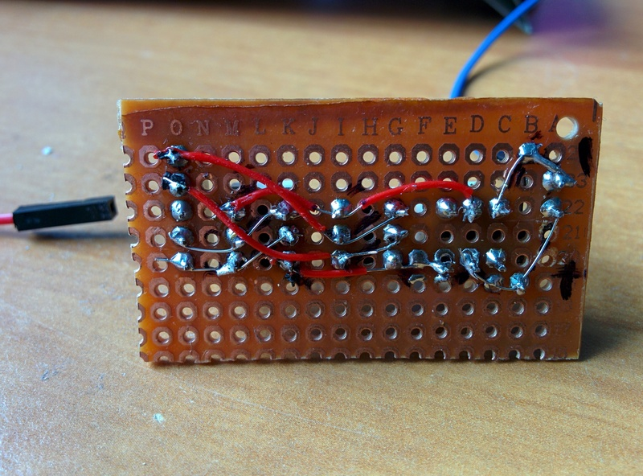

===
date: 2018-02-24
===
# Driving stepper motor

Some time ago I came across tutorial [how to make mini plotter from two CD/DVD drives](http://www.instructables.com/id/Arduino-Mini-CNC-Plotter-Machine-from-dvd-drives/).
I said about it to my friend and for birthday I got broken DVD drive from him.

Tearing it apart was fun. I was most impressed when I discovered lens floating in magnetic field created by two strong magnets.
I found an [engineering class materials](http://www.control.lth.se/media/Education/EngineeringProgram/FRTN10/2011/Lec05_DVDplayer_notes2011.pdf) describing this incredible stuff.

Since it was my first experience with stepper motors I started slowly.
First I did simple board with 3 [buttons](https://www.aliexpress.com/item/10pcs-NEW-8X8mm-Blue-Cap-Self-locking-Type-Square-Button-Switch-8-8-mm/32826635282.html?spm=2114.search0104.3.14.7f2bffae2BawFH&ws_ab_test=searchweb0_0,searchweb201602_1_10152_10151_10065_10344_10068_10342_10343_10340_10341_10084_10083_10618_10630_10304_10307_10301_5711211_10313_10059_5722311_10534_100031_10103_10627_10626_10624_10623_10622_10621_10620_5711311_10142,searchweb201603_38,ppcSwitch_3&algo_expid=eb111eaa-9159-42b4-abc8-dd5f4c43b417-2&algo_pvid=eb111eaa-9159-42b4-abc8-dd5f4c43b417&priceBeautifyAB=0) to manually control bipolar stepper motor.
Each of these buttons inside has two two-position switches. Something like:
```
 off               on
      .-- 2             .-- 2
     /
1 --* .-- 3       1 --*-.-- 3

      .-- 5             .-- 5
     /
4 --* .-- 6       4 --*-.-- 6
```
By connecting them right way I was able to reverse current flow for one coil with one button. Second button for second coil. Third button is main on/off switch.




By using this board I was able to verify that stepper actually works and what resistor should I use to limit current.

Knowing that it works I connected it trough [L293D](http://www.alldatasheet.com/view.jsp?Searchword=L293D) to
[Forth enabled blue pill](http://tomasz-cichocki.pl/t/posts/001-play-with-forth-and-STM32). Surprisingly, everything worked with no problems.

<iframe width="560" height="315" src="https://www.youtube.com/embed/mt8P-PPIaGw" frameborder="0" allow="autoplay; encrypted-media" allowfullscreen></iframe>

I tried full stepping and half stepping. I think half stepping gives less vibrations and I see no difference in torque...
Please see [Forth source code](https://github.com/tocisz/forthplay/tree/master/stepper) if you are interested.
