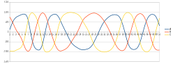

===
date: 2018-03-10
===
# Hall effect sensors
Today's edition of my scrap electronic series is about
[hall effect sensors].
These sensors detect magnetic field and are very practical when position of
some mechanical elements needs to be detected contactlessly.

You can find them in CD/DVD drives. Main motor that rotates CD/DVD disc
is so called brushless DC motor. From operating point of view it is simillar
to stepper motor with big step of 30 deg (only 12 steps for full revolution).
The particular type that I found in my scrap DVD has 3 inputs to drive the motor.


To drive it effectively motor control circuit has to put electrical current
trough 2 out of 3 inputs in the right sequence, e.g.:
```
  0 1 2 3 4 5 0 1 2 3 4 5 ...
A +   - -   + +   - -   + ...
B - -   + +   - -   + +   ...
C   + +   - -   + +   - - ...
```
For more explanation see [this youtube video](https://youtu.be/ZAY5JInyHXY).

But how does the control circuit of a motor know what is the position of the rotor
and when it's the best time to switch to the next step in the sequence?
Hall effect sensors can be used for that.

The little black chip below motor labelled HU is one of three sensors that I
found in my BLDC motor.
Very convinently rotor of the motor has magnets arond it, so its position can
be detected by these little sensors.


The hardest part was connecting to it. Soldering thin wire with a simple soldering
iron I have and my lack of soldering skills was not promissing any success.
As you can see on the first photo it looks ugly. But somehow it works...

Usually two outputs of hall effect sensor are compared by comparator circuit
and there is only binary output. But each of these sensors has 1 pins.
Two of them are shared by all three sensors, so I guess that it's `VCC` and `GND`.
The other two I connected to ADC on the microcontroller.

I noticed that when I rotate motor and one of two inputs is increasing voltage
then the other is decreasing voltage. So as a reading from the sensor I take
difference of reading of two outputs. Below is a complete program I used
to get readings:

```forth
adc-init
adc-calib

\ execute passed fn in 20 ms cycle untill key is pressed
: cycle ( fn -- )
  begin
    cr
    20 ms
    dup execute
  key? until
  drop
;

: probe-ad ( -- )
  PA0 adc PA1 adc - .
  PA2 adc PA3 adc - .
  PA4 adc PA5 adc - .
;

' probe-ad cycle
```

Below is a plot of the readings I got when rotating motor manually. How many RPM
I was doing? :-)
.

Has STM32 possibility to make an interrupt by comparing two analog imputs?
If it has, it should be easy to write logic that keeps track of motor possition.
Than it can be used as a control wheel for some user interface.
I leave this as an excercise to the reader... and please send me the code :-).
