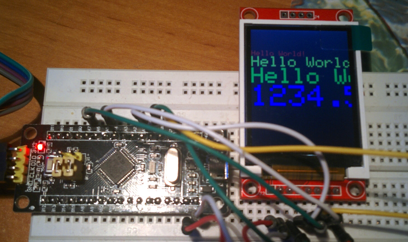

===
date: 2018-05-10
===
# LCD Screens

Nothing really interesting here. I just want to document how to connect two
LCD screens to a blue pill.

## ST7735 1.8'' TFT LCD



Connect as follows.

```
STM32  3.3 --- VCC  LCD
       GND --- GND
       AO  --- CS
       A1  --- RESET
       C13 --- AO
       A7  --- SDA
       A5  --- SCK
       3.3 --- LED
```

I used code from ... TODO.

## 2.4'' TFT LCD

Connect as in [this article](https://www.instructables.com/id/Fast-Portable-and-Affordable-Oscilloscope-and-Indu/).
